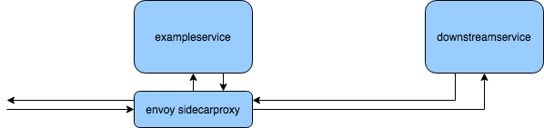

# Hystrix example

This project uses Hystrix, Memcached, Spring Boot applications, and an Envoy sidecar proxy as a mini-example architecture. 



The goal is to talk to `exampleservice`, which will fetch a result from `downstreamservice`. The requests to and from `exampleservice` are routed through a sidecar proxy using [Envoy](https://envoyproxy.io). All requests to the `exampleservice` are routed through the sidecar proxy running at `localhost:10000`

# Running the example

To run the application, run
```bash
mvn clean install
```
in the root directory, which will build and pull the required Docker images.

Then run
```bash
./scripts/start_all.sh
```

You can verify that the service is running by calling
```bash
curl -v localhost:10000/persons/12345
```

(you may need to run it twice, as the first request may timeout while both services initialize.)

### Example scenarios

Certain scenarios (failover, timeouts, etc) can be triggered with the following:

Scenario | URI | Response 
--- | --- | ---
Happy path | `localhost:10000/persons/{any_id}` | `{ "id": "any_id", "name": "ben" }`
Downstream timeout | `localhost:10000/persons/timeout` | HTTP 500 - if multiple timeouts are run in quick succession, you will notice that Hystrix does not continue send the request to the downstream service - the circuit breaker will **OPEN**, and you can see that by trailing the `exampleservice` Docker logs. The circuit breaker will not close again for another few seconds.
Entity not found scenario | `localhost:10000/persons/notfound` | HTTP 404 - this is configured not to open the circuit breaker - you can send as many of these as you want and the circuit breaker will stay closed.
Unprocessable entity scenario | `localhost:10000/persons/unprocessable` | HTTP 422 - this is configured not to open the circuit breaker - you can send as many of these as you want and the circuit breaker will stay closed.
